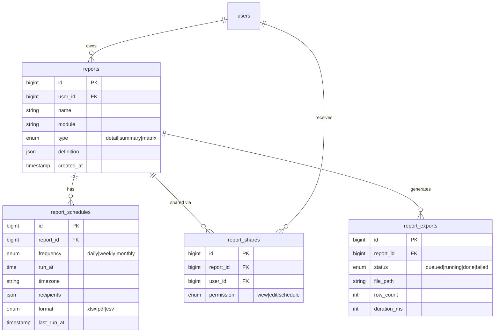

# Advanced Report Builder ⭐ FLAGSHIP

> Dynamic reporting engine — users describe a report in the UI, the API compiles it to optimized SQL, and the result renders as tables, charts, or scheduled exports.
>
> **This file is the actual README to ship with the repo.** Companion docs: [ARCHITECTURE.md](ARCHITECTURE.md) (deep design + interview prep).

<!-- Badges -->


<!-- [[SCREENSHOT: hero shot of the builder UI with a matrix report + chart preview — see ../../screenshots/SHOTLIST.md]] -->

## Why this exists

I build reporting systems professionally for an enterprise CRM. This project is a from-scratch, open-source implementation of the same architecture: a **report definition language** (JSON), a **safe SQL compiler**, and a **builder UI** — the three pieces every serious reporting product needs.

## Features

- **Report types:** Detail (rows), Summary (grouped + aggregates), Matrix (rows × columns pivot)
- **Builder UI:** pick module → fields → filters → group-by (multi-level) → aggregates (SUM/AVG/COUNT/MIN/MAX) → sort → chart
- **Filter engine:** AND/OR condition groups, 15+ operators, absolute dates, relative dates (`last_7_days`, `this_quarter`, `previous_month`), saved filters
- **Charts:** bar, stacked bar, line, area, pie, donut, funnel, treemap, bubble — one theming layer, drill-down to rows
- **Scheduling:** daily/weekly/monthly, timezone-aware, email delivery with Excel/PDF attached (queued jobs)
- **Exports:** Excel / CSV / PDF — chunked + streamed, flat memory on 1M+ rows
- **Sharing & RBAC:** owner / editor / viewer per report, role-based module access
- **Performance:** compiled SQL uses indexes deliberately; N+1-free; EXPLAIN-verified query shapes

## Tech stack

| Layer | Choice | Why |
|---|---|---|
| API | Laravel 12, PHP 8.3 | Scheduler + queues + Eloquent make report scheduling trivial to operate |
| SQL compiler | Custom service layer | The core of the project — see ARCHITECTURE.md |
| Frontend | React 19, TypeScript, Vite | Typed report definitions shared client/server |
| Data fetching | TanStack Query | Cache + invalidation for preview-as-you-build |
| Forms | React Hook Form + Zod | The builder is one big form; Zod mirrors the server-side definition schema |
| Charts | Chart.js | Lightweight, covers all 9 chart types |
| DB | PostgreSQL 16 | Window functions + rich aggregates for matrix reports; runs on SQLite locally for zero-setup dev |

## Quick start

```bash
# API
cd api
cp .env.example .env        # set DB credentials
composer install
php artisan key:generate
php artisan migrate --seed  # seeds demo CRM data: 50k leads, 10k deals
php artisan serve           # http://localhost:8000

# Worker + scheduler (separate terminals)
php artisan queue:work
php artisan schedule:work

# Frontend
cd ../web
npm install
npm run dev                 # http://localhost:5173
```

Demo login: `demo@example.com` / `password`

## Report definition (the contract everything compiles from)

```json
{
  "module": "leads",
  "type": "summary",
  "columns": ["source", "owner.name"],
  "groupBy": [{ "field": "source" }, { "field": "owner_id" }],
  "aggregates": [
    { "fn": "count", "field": "*", "alias": "total_leads" },
    { "fn": "sum", "field": "deal_value", "alias": "pipeline" }
  ],
  "filters": {
    "logic": "and",
    "conditions": [
      { "field": "created_at", "op": "relative_date", "value": "last_90_days" },
      {
        "logic": "or",
        "conditions": [
          { "field": "status", "op": "in", "value": ["new", "contacted"] },
          { "field": "deal_value", "op": ">", "value": 100000 }
        ]
      }
    ]
  },
  "sort": [{ "field": "pipeline", "dir": "desc" }],
  "chart": { "type": "bar", "x": "source", "y": "pipeline" }
}
```

## API overview (full spec in `docs/api.md` once generated)

| Method | Endpoint | Purpose |
|---|---|---|
| POST | `/api/v1/auth/login` | JWT login |
| GET | `/api/v1/modules` | Reportable modules + field metadata |
| POST | `/api/v1/reports/preview` | Run a definition without saving (paginated) |
| POST | `/api/v1/reports` | Save report |
| GET | `/api/v1/reports/{id}/run` | Execute saved report |
| POST | `/api/v1/reports/{id}/export` | Queue Excel/CSV/PDF export |
| POST | `/api/v1/reports/{id}/schedules` | Create schedule (freq, time, recipients) |
| POST | `/api/v1/reports/{id}/share` | Share with user/role + permission |

## Database schema (core tables)



Demo CRM tables (`leads`, `deals`, `activities`, `users`) ship with seeders so reports have real data shapes to run against.

## Folder structure

```
advanced-report-builder/
├── api/                          # Laravel 12
│   ├── app/
│   │   ├── Http/Controllers/Api/V1/
│   │   ├── Models/
│   │   ├── Services/Reporting/   # ← the engine
│   │   │   ├── ReportCompiler.php        # definition → query builder
│   │   │   ├── FilterCompiler.php        # condition tree → WHERE
│   │   │   ├── RelativeDateResolver.php  # "last_7_days" → range
│   │   │   ├── MatrixTransformer.php     # rows → pivot
│   │   │   └── FieldRegistry.php         # whitelist: module → allowed fields
│   │   ├── Jobs/ (RunScheduledReport, GenerateExport)
│   │   └── Exports/ (chunked xlsx/csv/pdf writers)
│   ├── database/ (migrations, seeders, factories)
│   └── tests/ (Feature + Unit — compiler has the densest coverage)
└── web/                          # React 19 + Vite + TS
    └── src/
        ├── features/builder/     # field picker, filter tree, group-by, chart config
        ├── features/reports/     # list, run view, exports
        ├── features/schedules/
        ├── components/ui/        # shared primitives
        ├── lib/api.ts            # typed client
        └── types/report.ts       # ReportDefinition — mirrors Zod schema
```

## Screenshots

<!-- [[SCREENSHOT: builder]] [[SCREENSHOT: matrix report]] [[SCREENSHOT: chart view]] [[SCREENSHOT: schedule modal]] -->
*(coming with v1.0 — see roadmap)*

## Roadmap

- [x] v0.1 — detail reports + filter engine
- [x] v0.2 — summary reports, aggregates, charts
- [ ] v0.3 — matrix reports, exports
- [ ] v0.4 — scheduling + email delivery
- [ ] v1.0 — sharing/RBAC, demo deployment, docs site
- [ ] v1.1 — PostgreSQL driver, dashboard widget embeds

## License

MIT
